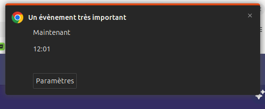

# Outlook Reminders → System Notifications

Chrome extension (Manifest V3) that turns Outlook web's **in-page calendar reminder pop-up**
into a **system notification**, so reminders are not missed when the Outlook window is in the
background, minimized or on another workspace.



It works by reading what the Outlook page already displays. It uses no Microsoft API
(no Graph, no EWS, no OAuth app), makes **no network request**, sends no telemetry and loads no
remote code. Everything stays in the browser.

## Quickstart

Install Outlook web as an app (PWA) and the extension, step by step:

- 🇬🇧 English: [docs/QUICKSTART.en.md](docs/QUICKSTART.en.md)
- 🇫🇷 Français : [docs/QUICKSTART.fr.md](docs/QUICKSTART.fr.md)

## How it works

```
Outlook page (tab or PWA)                       Service worker
┌──────────────────────────────────┐            ┌──────────────────────────────────────┐
│ detector.js  finds reminders in  │  message   │ background.js                        │
│              the DOM             │ ─────────► │  dedup across tabs (storage.session) │
│ content.js   MutationObserver,   │            │  chrome.notifications.create         │
│              per-tab dedup       │            │  click → focus the Outlook tab       │
└──────────────────────────────────┘            └──────────────────────────────────────┘
```

| File | Role |
|---|---|
| `manifest.json` | Permissions, content script declaration |
| `src/detector.js` | **Only** file that knows Outlook's DOM. Ordered fallback strategies |
| `src/content.js` | Watches DOM changes, sends each new reminder once |
| `src/background.js` | Shows the notification, dedups, brings Outlook to the front on click |
| `src/options.html` / `options.js` | Enable/disable, keep imminent reminders on screen, debug mode |
| `_locales/` | English and French texts |
| `test/` | Detector tests on HTML fixtures (dev only) |
| `diagnostic/` | One-off tool used to capture the pop-up's HTML (dev only, separate extension) |

**Notification content**: event title; start time · location (for Teams meetings Outlook shows
"Réunion Microsoft Teams" / "Microsoft Teams Meeting"); Outlook's status ("Maintenant", "In 5 min"…).
A reminder starting within 5 minutes (or already started) gets high priority and, by default,
stays on screen until clicked.

**No duplicates**: one notification per reminder per day, even when Outlook re-renders the pop-up
or when Outlook is open in several tabs/windows. Keys are kept in `chrome.storage.session`
(memory only, cleared when Chrome quits).

## Install (developer mode)

1. `chrome://extensions` → enable **Developer mode** (top right).
2. **Load unpacked** → select this repository's root folder (the one containing `manifest.json`).
3. Reload any open Outlook tab / PWA window (content scripts are only injected on page load).
4. Optional: extension **Details → Extension options**.

Recommended Chrome setting: `chrome://settings/performance` → **Always keep these sites active**
→ add `outlook.cloud.microsoft` (see limitations: a discarded tab shows no reminder).

After updating the code: click the reload icon on the extension card, then reload Outlook.

## Permissions

| Permission | Why |
|---|---|
| `notifications` | Show the system notification |
| `storage` | `storage.session`: dedup keys and notification → tab mapping (memory only). `storage.local`: the three options (never synced) |
| Content script on `https://outlook.cloud.microsoft/*`, `https://outlook.office.com/*`, `https://outlook.office365.com/*` | Read the reminder pop-up. No other site is accessed |

No `host_permissions`, no `tabs`, no `scripting`, no `<all_urls>`. Focusing the Outlook tab on
click uses `chrome.windows.update` / `chrome.tabs.update`, which do not require the `tabs` permission.

## Tests

### Automated: detector against fixtures

`test/fixtures/` holds HTML samples of the reminder pane (one real, anonymized capture and
synthetic variants for fallback strategies and a negative case). Each starts with an
`<!-- expected: [...] -->` comment.

- In Chrome, with the extension loaded: open
  `chrome-extension://<extension id>/test/detector-test.html` (id shown on `chrome://extensions`).
- Or headless:
  ```bash
  google-chrome --headless=new --allow-file-access-from-files --user-data-dir="$(mktemp -d)" \
    --virtual-time-budget=5000 --dump-dom "file://$PWD/test/detector-test.html" | grep -o 'ALL PASSED[^<]*\|FAILED[^<]*'
  ```

### Manual test cases (real Outlook)

Create test events with a short reminder: start = now + 7 min (type the time by hand),
reminder "5 minutes before".

| # | Case | Steps | Expected |
|---|---|---|---|
| 1 | Simple reminder, window visible | One event; keep Outlook in the foreground | One system notification: title, time · location, status. Outlook's in-page pane still shows |
| 2 | Several simultaneous reminders | Two events with the same start and reminder | Two notifications, one per event |
| 3 | Already-seen reminder | After case 1, let Outlook update the pane ("Maintenant" → "En retard…"), switch calendar views, open/close the pane | No new notification |
| 4 | Page reload | After case 1, reload the Outlook tab while the reminder is still displayed | No new notification (dedup survives in the service worker for the browser session) |
| 5 | Tab + PWA | Outlook open both in a tab and in the PWA | One notification only |
| 6 | Minimized window | Minimize Outlook before the reminder time | Notification appears (possibly delayed, see limitations); click → Outlook restored and focused |
| 7 | Background tab | Outlook in a background tab of a window, another tab active | Notification; click → Outlook tab activated |
| 8 | Imminent vs early | Reminder 15 min before vs 0 min before | 0 min: stays on screen until clicked (if option on). 15 min: normal notification |
| 9 | Disabled | Uncheck "Show system notifications" in options | No notification; Outlook unaffected |
| 10 | Tab closed before click | Get a notification, close Outlook, click the notification | Outlook calendar opens in a new tab |
| 11 | English UI | Switch Outlook to English, repeat case 1 | Same result |

## Known limitations

- **Outlook must be open and loaded.** The extension only sees what Outlook renders. Closed tab,
  tab discarded by Memory Saver, or Outlook not yet loaded → no reminder. Use "Always keep these
  sites active" (see Install).
- **Background delay.** Chrome throttles timers in hidden pages; Outlook's own reminder may then
  appear late (typically up to a minute). The extension reacts as soon as Outlook renders it.
- **No meeting link.** The pane only has a "Join Teams meeting" button, no URL; the notification
  shows the location text ("Réunion Microsoft Teams"). Clicking it brings Outlook forward, where the
  join button is.
- **Snoozed reminders** that come back the same day are not notified again (same dedup key).
- **Start time only**, no date (Outlook shows none). "Imminent" assumes the closest occurrence.
- **Window focus on click** depends on the OS / window manager, which may refuse to raise a window
  (focus-stealing prevention) and highlight it instead.
- **Sound**: the OS default notification sound, if enabled at OS level. A custom sound would need
  the `offscreen` permission and is not implemented.
- OS "Do not disturb" mode and OS-level notification settings for Chrome apply as usual.

## When Outlook changes its DOM

Symptom: Outlook's in-page reminder appears but no system notification.

1. Enable **debug mode** (options), reload Outlook, open DevTools console, filter `[OWN]`.
   If a reminder is logged with strategy `pane` or `aria-text` instead of `ids`, detection still
   works through a fallback but the primary selectors are outdated.
2. If nothing is logged: load `diagnostic/` as a second unpacked extension (see
   `diagnostic/README.md`), trigger a test reminder and copy the logged `outerHTML`.
3. Anonymize it, save it as a new fixture in `test/fixtures/` (add it to `fixtures.json`), with the
   expected result in the first-line comment.
4. Update `CONFIG` / strategies in `src/detector.js` only (never rely on generated class names),
   until **all** fixtures pass. Bump `version` in `manifest.json`.

## Packaging

For distribution (zip / Chrome Web Store / enterprise policy), ship only `manifest.json`, `src/`,
`icons/` and `_locales/` — exclude `diagnostic/`, `test/`, `docs/`, `.claude/`.

## License

Copyright (c) 2026 Vianney Bajart.

Licensed under the [European Union Public Licence v. 1.2](LICENSE) (EUPL-1.2).
The EUPL is available in all official EU languages at
<https://joinup.ec.europa.eu/collection/eupl/eupl-text-eupl-12>.
